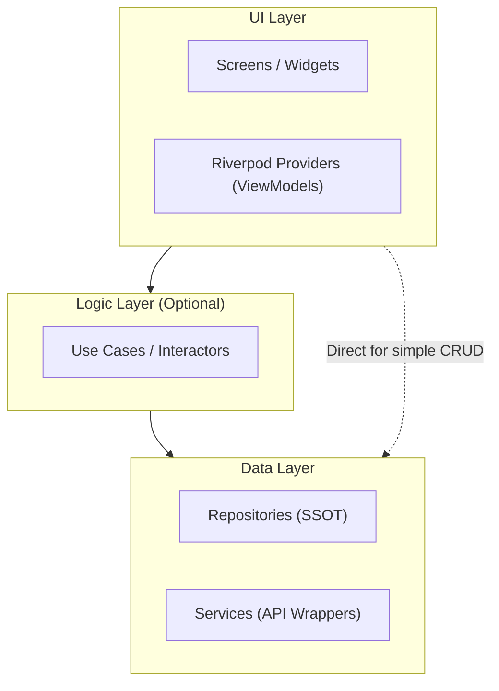
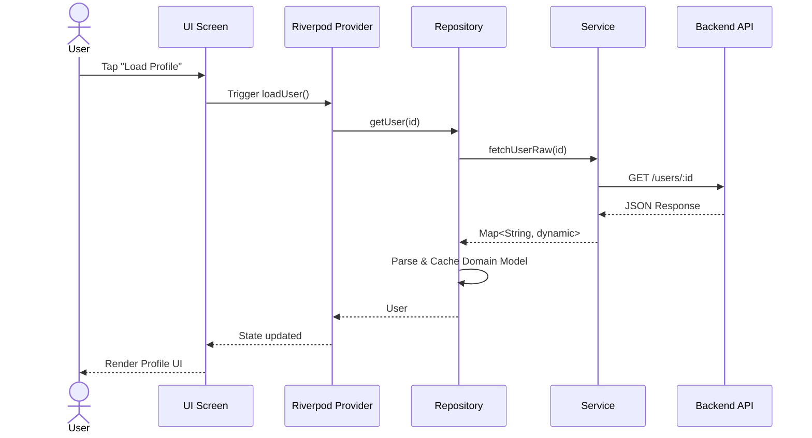

# Flutter Architecture Guide

> This document defines the architectural principles, layer separation, and implementation workflow for the Medicine Bank Flutter application.

## Table of Contents

- [Overview](#overview)
- [Core Principles](#core-principles)
- [Layered Architecture](#layered-architecture)
  - [1. UI Layer (Presentation)](#1-ui-layer-presentation)
  - [2. Logic Layer (Domain)](#2-logic-layer-domain)
  - [3. Data Layer (Infrastructure)](#3-data-layer-infrastructure)
- [Data Flow](#data-flow)
- [Project Structure](#project-structure)
- [Feature Implementation Workflow](#feature-implementation-workflow)
- [Code Examples](#code-examples)
- [Testing Strategy](#testing-strategy)

---

## Overview

The application follows a **layered architecture** with unidirectional data flow. State is managed using [Riverpod](https://riverpod.dev/), and the codebase is organized by feature within distinct architectural layers.



---

## Core Principles

### 1. Separation of Concerns
Decouple UI rendering from business logic and data fetching. A screen should never contain HTTP logic or direct database access.

### 2. Single Source of Truth (SSOT)
Repositories are the only components authorized to mutate and cache domain data. All UI state is derived from repository output.

### 3. Unidirectional Data Flow (UDF)
- **Down**: Data and state flow from Repositories -> Providers -> Widgets.
- **Up**: Events and commands flow from Widgets -> Providers -> Repositories.

### 4. UI as a Function of State
Drive the UI entirely via immutable state objects. Widgets rebuild reactively when the underlying state changes.

---

## Layered Architecture

### 1. UI Layer (Presentation)

**Responsibility:** Render the user interface and react to state changes.

| Component | Role | Rules |
|---|---|---|
| **Screens** | Full-page widgets | No business logic. Only layout, routing, and animation. |
| **Widgets** | Reusable components | Pure and stateless where possible. |
| **Providers** | State management (ViewModels) | Consume repositories, expose state, handle user events. |

**Rules for this layer:**
- Do not perform HTTP requests directly.
- Do not parse raw JSON.
- Do not cache application data in `State` or `StateNotifier` beyond UI-specific concerns (e.g., form input, scroll position).

### 2. Logic Layer (Domain)

**Responsibility:** Encapsulate complex business rules that do not belong in the UI or data layers.

| Scenario | Action |
|---|---|
| Complex orchestration (e.g., checkout requires validation + inventory check + payment) | Implement a **Use Case** class. |
| Simple CRUD (e.g., fetch user profile, list medicines) | **Omit this layer.** Providers talk directly to Repositories. |

**Rules for this layer:**
- Pure Dart logic. No Flutter or HTTP imports.
- Receives and returns Domain Models.
- Never references UI or Service classes.

### 3. Data Layer (Infrastructure)

**Responsibility:** Act as the SSOT for all application data.

#### Services
- Wrap external APIs, local databases, and platform plugins.
- Stateless classes. One service per external data source.
- Return raw, unprocessed data (e.g., `Map<String, dynamic>`, JSON strings).

#### Repositories
- Consume services and transform raw data into **Domain Models**.
- Handle caching, offline synchronization, and retry logic.
- Expose clean APIs for the UI/Logic layers.

**Rules for this layer:**
- Services are dumb. Repositories are smart.
- Only repositories cache domain data.

---

## Data Flow



---

## Project Structure

```text
lib/
├── core/                          # Cross-cutting concerns
│   ├── network/                   # ApiClient, Dio/Http config
│   ├── theme/                     # AppTheme, colors, typography
│   ├── routing/                   # GoRouter / Navigator configuration
│   └── constants/                 # App-wide constants
│
├── features/                      # Feature modules
│   └── [feature_name]/            # e.g., auth, donation, medicine
│       ├── models/                # Domain models + dummy data
│       ├── providers/             # Riverpod providers (ViewModels)
│       ├── screens/               # UI screens for the feature
│       ├── widgets/               # Reusable widgets for the feature
│       └── repositories/          # Feature-specific repositories (optional)
│
├── shared/                        # Globally reusable UI components
│   ├── widgets/                   # Buttons, inputs, cards
│   └── utils/                     # Formatters, validators
│
└── main.dart                      # App entry point
```

**Note:** The `lib/core/network/services/` directory contains global services (e.g., `AuthService`, `MedicineService`) shared across features.

---

## Feature Implementation Workflow

Follow this checklist when implementing a new feature:

- [ ] **Step 1: Define Domain Models.** Create immutable Dart classes representing the feature's data structures.
- [ ] **Step 2: Implement Services.** Create stateless service classes to fetch raw data (e.g., HTTP GET/POST).
- [ ] **Step 3: Implement Repositories.** Create repositories that consume services, handle caching, and return domain models.
- [ ] **Step 4: Implement Providers.** Create Riverpod providers that consume repositories, expose immutable `AsyncValue` state, and define command methods.
- [ ] **Step 5: Implement Screens & Widgets.** Build Flutter widgets that watch providers and trigger methods on user interaction.
- [ ] **Step 6: Write Tests.** Unit test services, repositories, and providers. Widget test screens.

> **Feedback Loop:** Review test failures -> Fix logic/mocking errors -> Re-run tests until passing.

---

## Code Examples

### Data Layer: Service + Repository

```dart
// lib/core/network/services/user_service.dart

class UserService {
  final ApiClient _client;

  UserService(this._client);

  Future<Map<String, dynamic>> fetchUserRaw(String userId) async {
    final response = await _client.get('/users/$userId');
    return response.data;
  }
}
```

```dart
// lib/features/auth/models/user.dart

class User {
  final String id;
  final String name;

  const User({required this.id, required this.name});

  factory User.fromJson(Map<String, dynamic> json) {
    return User(
      id: json['id'].toString(),
      name: json['name'],
    );
  }
}
```

```dart
// lib/features/auth/repositories/user_repository.dart

class UserRepository {
  final UserService _service;
  User? _cachedUser;

  UserRepository(this._service);

  Future<User> getUser(String userId) async {
    if (_cachedUser != null && _cachedUser!.id == userId) {
      return _cachedUser!;
    }

    final rawData = await _service.fetchUserRaw(userId);
    final user = User.fromJson(rawData);

    _cachedUser = user;
    return user;
  }

  void clearCache() {
    _cachedUser = null;
  }
}
```

### UI Layer: Provider + Screen

```dart
// lib/features/auth/providers/user_provider.dart

final userRepositoryProvider = Provider<UserRepository>((ref) {
  final service = ref.watch(userServiceProvider);
  return UserRepository(service);
});

final userProvider = AsyncNotifierProvider<UserNotifier, User?>(UserNotifier.new);

class UserNotifier extends AsyncNotifier<User?> {
  @override
  Future<User?> build() async => null;

  Future<void> loadUser(String userId) async {
    state = const AsyncLoading();
    state = await AsyncValue.guard(() async {
      final repo = ref.read(userRepositoryProvider);
      return repo.getUser(userId);
    });
  }
}
```

```dart
// lib/features/auth/screens/profile_screen.dart

class ProfileScreen extends ConsumerWidget {
  const ProfileScreen({super.key});

  @override
  Widget build(BuildContext context, WidgetRef ref) {
    final userAsync = ref.watch(userProvider);

    return Scaffold(
      appBar: AppBar(title: const Text('Profile')),
      body: userAsync.when(
        data: (user) {
          if (user == null) return const Text('No user data.');
          return Text('Hello, ${user.name}');
        },
        loading: () => const Center(child: CircularProgressIndicator()),
        error: (err, _) => Text('Error: $err'),
      ),
    );
  }
}
```

---

## Testing Strategy

| Layer | Test Type | Scope |
|---|---|---|
| **Services** | Unit Test | Mock the HTTP client. Verify correct endpoints and payload structure. |
| **Repositories** | Unit Test | Mock services. Verify caching logic and model transformation. |
| **Providers** | Unit Test | Mock repositories. Verify state transitions and error handling. |
| **Screens** | Widget Test | Pump the widget tree. Verify UI reacts correctly to loading/error/data states. |

**Example: Testing a Provider**

```dart
test('userProvider loads user successfully', () async {
  final container = ProviderContainer(
    overrides: [
      userRepositoryProvider.overrideWithValue(MockUserRepository()),
    ],
  );

  final notifier = container.read(userProvider.notifier);
  await notifier.loadUser('123');

  final state = container.read(userProvider);
  expect(state.value?.name, 'John Doe');
});
```

---

## Quick Reference

| Concept | Implementation in this project |
|---|---|
| State Management | Riverpod (`AsyncNotifier`, `FutureProvider`, `StreamProvider`) |
| Dependency Injection | Riverpod `Provider` and `ref.watch` / `ref.read` |
| Navigation | `go_router` (declarative routing) |
| HTTP Client | Custom `ApiClient` wrapper (`lib/core/network/`) |
| Data Serialization | `freezed` + `json_serializable` |
| Local Storage | `SharedPreferences` (auth tokens, user info) |

---

## Related Documentation

| Document | Purpose |
|---|---|
| [GUIDE.md](GUIDE.md) | Master index for all documentation |
| [SETUP.md](SETUP.md) | Environment setup |
| [FRONTEND.md](FRONTEND.md) | Deep dive into every feature module |
| [BACKEND.md](BACKEND.md) | Stack-agnostic backend specification |
| [INTEGRATION.md](INTEGRATION.md) | Connection matrix and auth flow |
| [API_CONTRACT.md](API_CONTRACT.md) | Endpoint notes and special cases |
| [MODELS.md](MODELS.md) | Dart model field mappings |
| [DEPLOYMENT.md](DEPLOYMENT.md) | Build commands and release checklist |
| [TESTING.md](TESTING.md) | Unit, widget, and integration testing |

---

*Last updated: June 2026*
