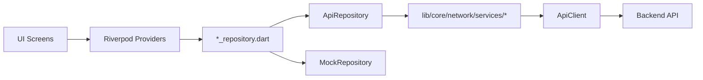
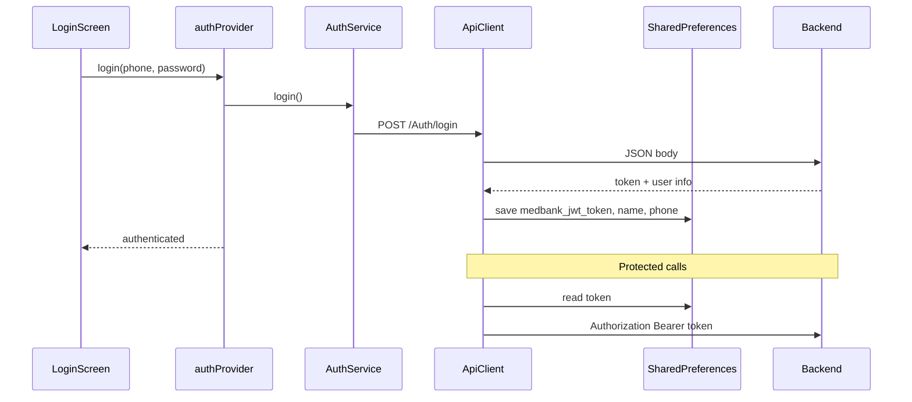

# Frontend/Backend Integration Guide

This document is the "what connects to what" bible for the Medicine Bank Flutter app, detailing how the frontend UI communicates with the backend API.

## Architecture

The frontend follows a clean separation of concerns using Riverpod for state management and the Repository Pattern:



- **UI Screens**: Know nothing about HTTP requests. They just watch providers.
- **Providers**: Manage loading states, error handling, and user events. They talk to abstract Repositories.
- **Repositories**: The single point of truth for data. Two implementations exist:
  - `*ApiRepository` — calls Services to hit the real backend.
  - `*MockRepository` — returns local dummy data for offline development.
- **Services**: Stateless wrappers over HTTP. One service per external API.
- **ApiClient**: A wrapper over `package:http` that automatically injects the JWT token as a Bearer header.

> **Note:** The `useLiveBackend` toggle has been moved out of providers and into the `*_repository_provider.dart` injection points. Providers themselves contain zero mock logic. See [FRONTEND.md](FRONTEND.md) for details.

## Authentication Flow



### SharedPreferences Keys

| Key | Content |
|---|---|
| `medbank_jwt_token` | JWT string |
| `medbank_user_name` | Full name |
| `medbank_user_phone` | Phone number |

## Connection Matrix

**Screen → Provider → Repository → Service → Endpoint**

| Screen / Feature | Provider | Repository | Service method | HTTP | Endpoint | Auth |
|---|---|---|---|---|---|---|
| Login | `authProvider` | `AuthRepository` | `AuthService.login()` | POST | `/Auth/login` | No |
| Sign up | `authProvider` | `AuthRepository` | `AuthService.register()` | POST | `/Auth/register` | No |
| Session restore | `authProvider` | `AuthRepository` | `AuthService.hasSession()` | — | local only | — |
| Logout | `authProvider` | `AuthRepository` | `AuthService.logout()` | — | clears prefs | — |
| Browse / search | `medicineSearchProvider` | `MedicineRepository` | `MedicineService.getAll()` | GET | `/Medicine` | No |
| Category list | `categoryMedicinesProvider` | `MedicineRepository` | `MedicineService.getByCategory()` | GET | `/Medicine/by-category/:category` | No |
| Medicine details | `medicineDetailsProvider` | `MedicineRepository` | `MedicineService.getById()` | GET | `/Medicine/:id` | No |
| Donate form | `donationProvider` | `DonationRepository` | `DonationService.create()` | POST | `/Donation` | Bearer |
| My donations | `donationProvider` | `DonationRepository` | `DonationService.getMyDonations()` | GET | `/Donation/my-donation` | Bearer |
| Request form | `requestProvider` | `RequestRepository` | `RequestService.checkout()` | POST | `/Request/checkout` | Bearer |
| My requests | `requestProvider` | `RequestRepository` | `RequestService.getHistory()` | GET | `/Request/history` | Bearer |
| Notifications | `notificationProvider` | `NotificationRepository` | `NotificationService.*` | GET/POST | `/Notification/*` | Bearer |
| Edit profile | — | `AuthRepository` | `AuthService.updateProfile()` | PUT | `/Auth/update-profile` | Bearer |
| Pharmacy | — | — | `PharmacyService.*` | GET | `/Pharmacy/*` | No |
| Stats | — | — | `StatsService.getStats()` | GET | `/stats` | No |

## Error Handling Contract

- **Status Codes**: 
  - `2xx`: Success
  - `401`: Unauthorized (App will handle by requiring login, though token refresh is not fully implemented yet)
  - `4xx`: Client Error (App displays the message returned by the API)
  - `5xx`: Server Error
- **`ApiException` Types**: The frontend `ApiClient` throws `ApiException` which is caught by providers and surfaced as UI snackbars.
- **Expected JSON Error Shape**: The frontend expects errors to be returned as JSON, typically reading the `message` field to display to the user.

## Known Gaps

- **Notifications & Pharmacy**: The services and repositories exist, but the UI is pending.
- **Token Expiry**: No `GET /Auth/me` on startup. The app trusts the local token. The backend should handle token validation, but the frontend currently lacks a global 401 interceptor for automatic logout.
- **Forgot/Change Password**: No endpoints exist yet.

## Related Documentation

| Document | Purpose |
|---|---|
| [BACKEND.md](BACKEND.md) | Complete stack-agnostic backend spec with SQL schema |
| [FRONTEND.md](FRONTEND.md) | How the Repository Pattern works in the frontend |
| [API_CONTRACT.md](API_CONTRACT.md) | Endpoint notes and special cases |
| [MODELS.md](MODELS.md) | Dart model field mappings |

## Testing Integration

To test the app connected to a real backend, run the app using the `dart-define` flags:

```sh
flutter run \
  --dart-define=API_BASE_URL=https://your-server.com/api \
  --dart-define=USE_LIVE_BACKEND=true
```
